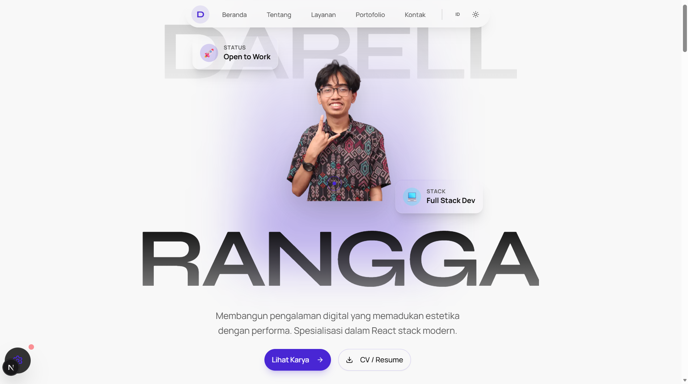
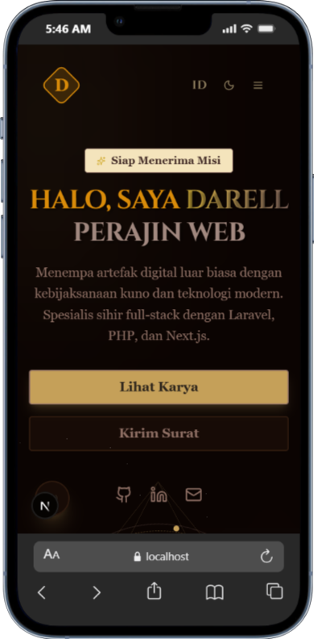

<div align="center">

  

# ⚡ Darell Rangga: Digital Operations Center

**"Bridging Advanced Engineering & Futuristic Web Design"**

[](https://nextjs.org/)
[](https://www.typescriptlang.org/)
[](https://tailwindcss.com/)
[](https://www.framer.com/motion/)

[🚀 Lihat Demo Langsung](https://darell-rangga.vercel.app/) • [🐛 Lapor Bug](https://github.com/Rangga11268/my-portfolio/issues) • [✨ Request Fitur](https://github.com/Rangga11268/my-portfolio/issues)

</div>

---

## 🔮 Visi: "Cyber-Architecture"

Selamat datang di portofolio pribadi saya. Proyek ini bukan sekadar _showcase_ kode, melainkan sebuah **Sistem Digital** yang dirancang dengan presisi untuk tujuan:

> _Membuktikan bahwa website modern tidak harus statis. Dengan menggabungkan estetika **"Cyberpunk"**, antarmuka holografik, dan interaksi yang halus, saya menciptakan pengalaman pengguna yang imersif._

### 🌌 Fitur Utama (System Modules)

| Ikon | Nama Modul               | Deskripsi Sistem                                                                                                         |
| :--: | :----------------------- | :----------------------------------------------------------------------------------------------------------------------- |
|  ☁️  | **Holographic Services** | Section layanan modern dengan kartu harga (Pricing Packages) transparan, detail modal, dan integrasi WhatsApp.           |
|  🤖  | **Rangga-AI Terminal**   | Digital Twin AI yang dapat menjawab pertanyaan tentang CV, pengalaman, dan skill secara interaktif (Powered by Gemini).  |
|  🎛️  | **Command Center**       | Dashboard holografik _real-time_ yang menampilkan status sistem, widget waktu zona server, dan **GitHub Activity Live**. |
|  👨‍💻  | **Code Playground**      | Mode "Developer" interaktif. Pengunjung dapat mengedit tema website secara langsung layaknya di VS Code.                 |
|      | **Adaptive Navigation**  | Navbar _glassmorphic_ yang melayang, dengan efek buram adaptif dan teks yang membesar secara responsif.                  |
|  📜  | **Infinite Skills**      | Marquee _skill_ tanpa batas (infinite scroll) dengan tampilan kartu modul modern yang mengalir mulus.                    |
|  🌗  | **Bi-Phase Theme**       | Sistem tema interaktif yang berganti antara mode Light & Dark secara dinamis, terintegrasi dengan seluruh widget.        |
|  🗣️  | **Language Protocol**    | Dukungan i18n (Inggris/Indonesia) instan tanpa _reload_, menerjemahkan konten secara akurat.                             |

---

## 📸 System Gallery (Under Maintenance)

<!-- Images currently being updated
<div align="center">

|          **The Command Center (Dark Mode)**          |             **Code Playground (Theme Editor)**             |
| :--------------------------------------------------: | :--------------------------------------------------------: |
|  |  |

|                **Responsive Mobile View**                 |           **Interactive Projects (Glass Slide)**           |
| :-------------------------------------------------------: | :--------------------------------------------------------: |
|  |  |

</div>
-->

<details>
<summary>📱 <b>Klik untuk melihat Arsip Lama (v1.0)</b></summary>
<br>
<div align="center">
  <!-- Legacy images commented out due to missing files
  <table>
    <tr>
      <td><b>Versi Klasik</b></td>
      <td><b>Kontak Merpati</b></td>
    </tr>
    <tr>
      <td></td>
      <td></td>
    </tr>
  </table>
  -->
  <p><i>Legacy screenshots archived.</i></p>
</div>
</details>

---

## 🛠️ Tech Stack (Arsenal)

Dibangun menggunakan teknologi mutakhir untuk performa maksimal:

- **Core**:  
- **Language**: 
- **Styling**: 
- **Animation**: 
- **State**:  & Context API
- **AI Integration**: 
- **Data**: 

---

## 📦 Services Offered

| Package             | Tech Stack                    | Ideal For                               |
| :------------------ | :---------------------------- | :-------------------------------------- |
| **Starter**         | React, Next.js, Framer Motion | Personal Portfolio, Landing Page        |
| **Business Growth** | **Laravel (Inertia)** + MySQL | UMKM, Company Profile, Data-driven Apps |
| **Enterprise**      | Full Stack Custom (MERN/T3)   | Large Scale Web Apps, SaaS              |

> **Note**: Whatsapp integration included for direct consultation.

---

## 📊 Developer Metrics (GitHub Stats)

<div align="center">

[](https://github.com/Rangga11268)

[](https://github.com/Rangga11268)

</div>

---

## 🚀 System deployment (Instalasi)

Ingin menjalankan sistem ini di mesin lokal Anda? Ikuti protokol berikut:

1.  **Clone Repository**:

    ```bash
    git clone https://github.com/Rangga11268/my-portfolio.git
    ```

2.  **Install Dependencies**:

    ```bash
    npm install
    # atau yarn install
    ```

3.  **Initiate Server**:

    ```bash
    npm run dev
    ```

4.  **Access Portal**: Buka `http://localhost:3000`.

---

## 🌐 Connect Protocol

<div align="center">
  <a href="https://github.com/Rangga11268/">
    
  </a>
  <a href="https://www.linkedin.com/in/darell-rangga-1320b634b/">
    
  </a>
  <a href="https://instagram.com/darellrangga17/">
    
  </a>
  <a href="https://x.com/ranggsdarell">
    
  </a>
</div>

<div align="center">
  <br>
  <p>Dilisensikan di bawah <a href="./LICENSE">MIT License</a></p>
  <p><i>Ditempa dengan ❤️ dan 🪄 oleh Darell Rangga</i></p>
</div>
